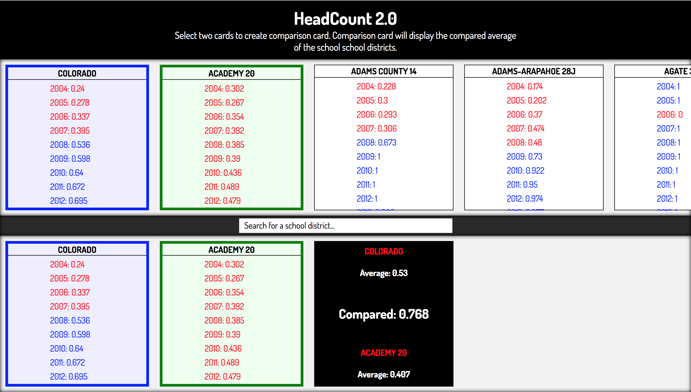

# HeadCount 2.0

Link to live applcation:
https://headcount-hs-1-30-2018.herokuapp.com/

##Application Description
Headcount 2.0 was designed to challenge my skills at manipulating data and creating small, reusable React components.

The application contains files that contain various educational stats from districts within Colorado by year, per district.  This data is manipulated and rendered to the screen for the user.  The user is able to select two cards to create a comparison card that will display the average stats of the selected cards.

